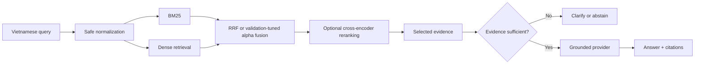

# VietRAG Policy Assistant

A lightweight Vietnamese RAG assistant for university regulations with
leakage-aware evaluation, hybrid retrieval, noisy-query handling, grounded
citations, and evidence-based abstention.

The repository implements **Direction 1 only** from
[`VIETRAG_PROJECT_CONTEXT.md`](VIETRAG_PROJECT_CONTEXT.md). It does not include
adaptive routing, context compression, attention probes, or paper-only
experiments.

## Why this project

University regulations contain exact article numbers, dates, thresholds,
percentages, and course codes. A useful assistant must preserve those details,
retrieve the correct clause under noisy Vietnamese queries, cite verifiable
evidence, and decline to answer when the corpus is insufficient. Retrieval is
evaluated independently from generation so an answer model cannot hide a weak
retriever.

## Key features

- Conservative Vietnamese normalization: Unicode NFKC, invisible-character
  removal, and whitespace normalization without rewriting legal content.
- Separate `raw_text` and `normalized_text` fields.
- Canonical context hashing and exact deduplication.
- Frozen context-disjoint splits and document-disjoint grouped folds.
- Pure-Python BM25, configurable Sentence Transformers dense retrieval, and a
  deterministic offline hashing fallback.
- Reciprocal Rank Fusion and validation-only weighted-score fusion.
- Configurable cross-encoder reranking with an offline lexical fallback.
- Query-level Recall@1/5/10, MRR@10, nDCG@10, and latency artifacts.
- Deterministic robustness variants with preservation audits.
- Offline extractive answers, stable citations, clarification, and abstention.
- One shared pipeline for tests, CLI, and Streamlit.

## Architecture



Article/section records are retrieved first. Sentence-level evidence is used
for extractive answers and citation snippets.

## Repository layout

```text
.
├── VIETRAG_PROJECT_CONTEXT.md
├── app.py
├── configs/
│   ├── default.yaml
│   └── experiments/P0_bm25.yaml ... P5_grounded_rag.yaml
├── data/
│   ├── README.md
│   ├── samples/raw_synthetic.jsonl
│   └── raw, interim, processed, manifests/
├── scripts/
├── src/vietrag/
│   ├── data, preprocessing, chunking
│   ├── retrieval, reranking, generation
│   ├── evaluation, utils
│   └── pipeline.py
├── experiments/
├── reports/
└── tests/
```

## Installation

Python 3.11 is recommended; the verified smoke run also supports Python 3.12.

```bash
python -m venv .venv
# Windows
.\.venv\Scripts\activate
python -m pip install --upgrade pip
pip install -r requirements.txt
```

The default pipeline is offline and does not download a model. To enable
Sentence Transformers and a production dense encoder:

```bash
pip install -r requirements-ml.txt
```

Then set `retrieval.dense.backend: sentence_transformers` in a copied
configuration. `BAAI/bge-m3` and `BAAI/bge-reranker-v2-m3` are configured model
candidates, not benchmark winners. Select final models on validation only.

## Quick start without restricted data

The tracked fixture is synthetic and authored for this repository.

```bash
python scripts/prepare_corpus.py --input data/samples/raw_synthetic.jsonl
python scripts/create_splits.py
python scripts/create_robustness_queries.py
python scripts/build_index.py --backend bm25 --output indexes/smoke_bm25
python scripts/evaluate_retrieval.py \
  --config configs/experiments/P2_hybrid_rrf.yaml \
  --split validation
python scripts/run_pipeline.py \
  "Điều kiện để đăng ký khóa luận tốt nghiệp là gì?"
streamlit run app.py
```

The demo automatically uses `data/processed/corpus.jsonl` when present and
falls back to the synthetic fixture otherwise.

## Data preparation

Review [`data/README.md`](data/README.md) before downloading anything.
ViRHE4QA is described upstream as research-only/non-commercial and is never
committed here.

```bash
python scripts/download_data.py --accept-license
python scripts/prepare_corpus.py --input data/raw/ViRHE4QA.zip
python scripts/audit_data.py
python scripts/create_splits.py --seed 42 --document-folds 5
python scripts/create_robustness_queries.py --seed 42
```

The parser supports JSON, JSONL, CSV, and ZIP containers with documented field
aliases. Upstream schema changes fail clearly rather than silently dropping all
records.

## Leakage-aware protocol

The enforced order is:

1. Parse records.
2. Normalize Unicode and whitespace conservatively.
3. Canonicalize and deduplicate contexts.
4. Compute `sha256:<digest>` context hashes.
5. Freeze context-disjoint splits and document-disjoint grouped folds.
6. Verify manifest coverage, checksum, gold-evidence assignment, and
   `base_query_id` grouping.
7. Generate noisy queries only from the frozen manifest.

The original ViRHE4QA split is stored as ignored provenance and is not used to
claim retrieval performance. Contexts or documents linked by multi-evidence
query families are assigned as one connected component. Test evaluation is
guarded:

```bash
python scripts/evaluate_retrieval.py \
  --config configs/experiments/P4_hybrid_reranker.yaml \
  --split test \
  --frozen-config configs/experiments/P4_hybrid_reranker.yaml
```

Do this only after all choices have been frozen from validation results.

## Experiments

| ID | Retrieval | Reranker | Generation |
|---|---|---|---|
| P0 | BM25 | No | No |
| P1 | Dense | No | No |
| P2 | Hybrid RRF | No | No |
| P3 | Hybrid normalized scores | No | No |
| P4 | Selected hybrid | Top 20 → top 5 | No |
| P5 | P4 | Yes | Citation + abstention |

Run a configuration with:

```bash
python scripts/evaluate_retrieval.py \
  --config configs/experiments/P0_bm25.yaml
```

Every run writes query-level predictions, JSON/CSV metrics, dependency and
hardware metadata, model identifiers/revisions, seed, split, parameters, and
latency to its experiment directory.

## Results

The first model-backed validation run is complete on 1,544 clean ViRHE4QA
queries from the frozen context-disjoint split. These are measured validation
results, not test-set claims.

| Pipeline | Recall@1 | Recall@5 | Recall@10 | MRR@10 | nDCG@10 | Mean latency |
|---|---:|---:|---:|---:|---:|---:|
| P0 BM25 | 0.7085 | 0.9229 | 0.9624 | 0.8036 | 0.8427 | 2.22 ms |
| P1 BGE-M3 | 0.5920 | 0.8329 | 0.8983 | 0.6956 | 0.7448 | 41.40 ms |
| P2 hybrid RRF | 0.6775 | 0.9113 | 0.9579 | 0.7765 | 0.8208 | 44.80 ms |
| P4 hybrid + reranker | **0.8497** | **0.9741** | n/a | **0.9036** | **0.9216** | 2,623.97 ms |

The archived P4 run retained five reranked passages, so its emitted
`recall@10` duplicated Recall@5 and is not reported. The evaluator now retains
enough reranked results for all configured cutoffs; P4 must be rerun for a true
Recall@10. P4 is the quality leader, while BM25 remains the practical low-
latency mode. Dense-only and equal-weight RRF do not beat BM25 on this split.

See [`reports/validation_results.md`](reports/validation_results.md) for paired
bootstrap confidence intervals, query-level transition counts, limitations,
and remaining experiments. EduCoQA, noisy-query robustness, P3 alpha fusion,
generation quality, abstention tuning, and the guarded test evaluation remain
pending.

The tracked synthetic fixture remains useful only for smoke tests. Restricted
data, query-level predictions, model artifacts, and generated indexes remain
Git-ignored.

## Grounded output examples

Synthetic answer:

```text
Question: Điều kiện để đăng ký khóa luận tốt nghiệp là gì?
Answer: Sinh viên được đăng ký khóa luận tốt nghiệp khi đã tích lũy ít nhất
100 tín chỉ và có điểm trung bình từ 2,50 trở lên.
Citation: Quy chế đào tạo 2026 — Điều 12
Evidence ID: DOC_..._ART_...
```

Insufficient evidence:

```text
Tôi chưa tìm thấy đủ bằng chứng trong các văn bản hiện có để trả lời câu hỏi này.
```

An extractive answer is a verbatim sentence from selected evidence. Its
citation is constructed from that retrieved record, not from provider text.
The optional OpenAI-compatible provider reads credentials only from environment
variables shown in `.env.example`.

## Robustness evaluation

Implemented variants are `clean`, `no_diacritic`, `typo`, `abbreviation`, and
`informal`. Paraphrases are skipped and audited unless a reliable generator is
explicitly supplied. `mixed_noise` is intentionally absent until individual
noise groups are validated.

Reports include metrics by noise type, absolute and relative drop from clean,
and worst-group MRR. Variants preserve split membership, gold evidence,
numbers, dates, percentages, and course codes; suspicious transformations are
flagged for manual review.

## Testing

```bash
python -m pytest
python -m pytest --cov=vietrag --cov-report=term-missing
```

Tests cover NFKC, invisible characters, preservation of identifiers and
numbers, stable hashes, exact deduplication, both split protocols, query-family
grouping, frozen-manifest integrity, deterministic retrieval, RRF, robustness
preservation, metrics, artifact writing, citations, abstention, clarification,
and an end-to-end offline pipeline.

## Error analysis

Use query-level predictions to classify:

1. Gold evidence not retrieved.
2. Correct evidence demoted by reranking.
3. Normalization damage to an entity, number, or code.
4. Noisy variant changed intent or gold evidence.
5. Answer ignored selected evidence.
6. Unsupported answer claim.
7. False abstention or missed abstention.
8. Wrong document version or neighboring clause.

No error rates are claimed until the real benchmark is run.

## Limitations

- The hashing encoder and lexical reranker are deterministic offline fallbacks,
  not substitutes for trained semantic models.
- The parser uses a documented alias map; a future upstream schema may require
  an explicit adapter.
- Rule-based typo, abbreviation, and informal variants require manual audit for
  benchmark publication.
- Evidence sufficiency is an overlap baseline. Its threshold must be selected
  on validation and evaluated on answerable and unanswerable data.
- The extractive provider cannot synthesize multi-clause answers.
- API-provider faithfulness needs claim-level evaluation before deployment.
- This is an educational/research assistant, not authoritative legal advice.

## Reproducibility and security

- Default seed: `42`.
- All experiment choices live in YAML.
- Restricted data, generated indexes, weights, secrets, and result artifacts
  are ignored.
- API keys are never hard-coded.
- The software license does not cover third-party data or models.

See [`experiments/README.md`](experiments/README.md) for artifact contracts and
[`VIETRAG_PROJECT_CONTEXT.md`](VIETRAG_PROJECT_CONTEXT.md) for the complete
research specification.
